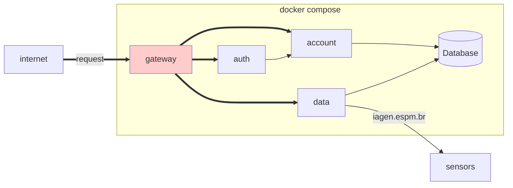
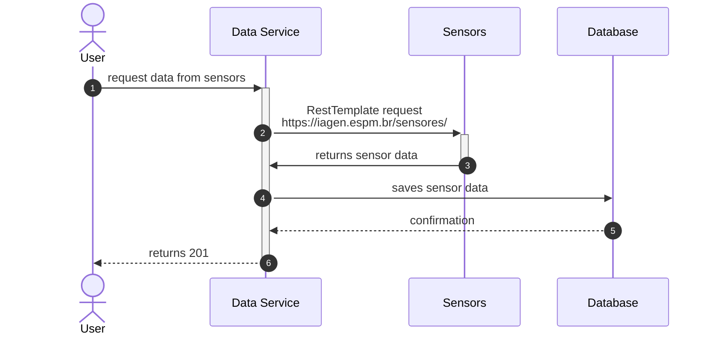
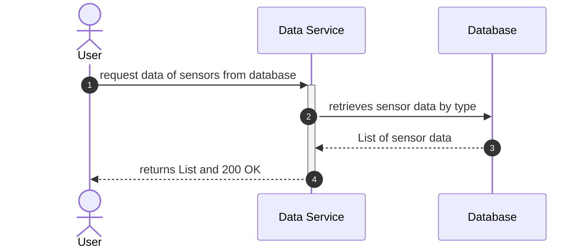

## Exercício 2

Utlizando Spring Boot, crie uma aplicação que permita o registro de usuários e autenticação. A aplicação deve permitir o cadastro de usuários com os seguintes campos:

- Nome
- E-mail
- Senha

A autenticação deve ser feita utilizando JWT (JSON Web Token). A aplicação deve ter as seguintes funcionalidades:

- Cadastro de usuários;
- Autenticação de usuários;
- Listagem de usuários cadastrados, apenas se o usuário estiver autenticado.

### Projeto Integrador

A fim de complementar com o Projeto Integrador:

Crie dois endpoints, que devem estar estar em um microserviço separado, sendo eles:

| Método | Endpoint              | Descrição                                                           | Resposta                       |
| ------ | --------------------- | ------------------------------------------------------------------- | ------------------------------ |
| `GET`  | `/data/import`        | Obtém os dados dos sensores e os registram dentro do banco de dados |                                |
| `GET`  | `/data/export/{type}` | Retorna os dados do sensor especificado na `path variable`          | `json` com os dados do sensor. |

Para ambos os endpoints, o usuário deve estar autenticado.

A arquitetura dos microserviços deve utilizar um gateway para rotear as requisições para os microserviços corretos. Utilize o Spring Cloud Gateway para isso.

### Diagrama de Seqüência

`GET` `/data/import`

> **Observação:** O microserviço de autenticação deve ser o primeiro a ser iniciado, pois os outros microserviços dependem dele para autenticação.

> **Atenção:** Cada sensor tem tipos de dados diferentes, portanto, estude uma estratégia adequada para persistir no banco de dados. Pode ser uma tabela genérica ou criar tabelas específicas para cada tipo de sensor (diversos `models`).

`GET` `/data/export/{type}`

